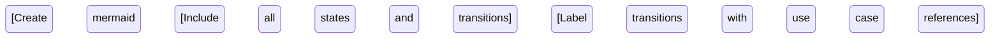

# Task: Deep Module Analysis and Documentation

## Input Parameters

- **Module to analyze**: `$ARGUMENTS`
- **Source file**: `.claude/documentation/modules.md`

## Validation Step

1. Verify that `$ARGUMENTS` exists in `modules.md`
2. If module NOT found → Return: `MODULE NOT IDENTIFIED. GENERATION ABORTED!`
3. If found → Extract the module's Java package path and documentation links

## Analysis Process

### Phase 1: Code Discovery

Starting from the package path identified in `modules.md`:

1. Map all Java classes within the module package and subpackages
2. Discover the architectural patterns actually used in this module by scanning for:
   - Entry points: REST controllers, message consumers/listeners, scheduled tasks, CLI runners, etc.
   - Service layer: service classes, use-case classes, handler classes, facades, etc.
   - Domain layer: entities, value objects, aggregates, enums, etc.
   - Persistence layer: repositories, DAOs, mappers, etc.
   - Any other patterns present (e.g., CQRS commands/queries, event handlers, saga/process managers)

   **Important**: Do not assume any specific architecture. Discover what is actually there.

### Phase 2: Documentation Gathering

1. Read all `.md` files linked in `modules.md` for this module
2. Scan integration and unit tests (look for test classes in `src/test/` matching the module's package) for:
   - Real usage examples
   - Business scenarios
   - Edge cases and validations
3. Check for API documentation (OpenAPI/Swagger annotations)
4. Review configuration files for module-specific settings

## Output Document Structure

Create `[module-name]-analysis.md` in `.claude/documentation/modules/` (relative to the project root):

````markdown
# [Module Name] - Detailed Analysis

## 1. Module Overview

### Purpose

[Comprehensive description of the module's purpose and role in the system]

### Business Value

[Explain the value this module provides to end users and the business]

### High-Level Use Cases

[Abstract summary of main functionalities - bullet points]

### Technical Boundaries

[What this module does and explicitly does NOT do]

## 2. Use Cases

[For each identified use case, create a subsection:]

### 2.1 [Use Case Name]

**Actor**: [Identify based on trigger type]

- REST API / HTTP endpoint → `APP USER` (specify auth/role constraints if found)
- Message consumer / event listener → `EXTERNAL SYSTEM` (name the source system/queue if identifiable)
- Scheduled job / cron → `SYSTEM (SCHEDULER)`
- Other → `UNKNOWN` (describe the trigger mechanism)

**Trigger**: [Specific class/method that initiates this use case]

**Business Value**: [1-2 sentences on why this use case exists]

**Detailed Flow**:

1. [Step-by-step description of the use case execution]
2. [Include all business validations and constraints]
3. [Reference specific classes/methods involved]

**Validations & Constraints**:

- [List all validation rules found in code]
- [Include error conditions and handling]

**Data Changes**:

- Input: [Required data/parameters]
- Output: [Response/side effects]
- Domain objects affected: [List entities modified]

---

[Repeat for each use case]

## 3. Module Domain Objects Lifecycle

### Domain Model

[List and briefly describe key domain entities, aggregates, and value objects]

### State Transitions



### User Interaction Flow

```mermaid
sequenceDiagram
    [Create sequence diagram showing typical user interactions]
    [Map user actions to use cases]
    [Show system responses and state changes]
```

## 4. Technical Architecture

### Key Components

| Component Type | Class/Interface | Responsibility |
| -------------- | --------------- | -------------- |
| [Discovered type, e.g. Controller / Service / Repository / Consumer / Job / etc.] | [List] | [Description] |

> Adapt component types to what actually exists in the module. Do not use categories that have no matching classes.

### External Dependencies

- [List other modules this module depends on]
- [External services/APIs consumed]

### Outbound Communication

- [Events/messages published, if any]
- [External API calls made, if any]
- [Omit this section if not applicable]

## 5. Integration Points

### REST Endpoints

| Method         | Path        | Use Case       | Actor Constraints |
| -------------- | ----------- | -------------- | ----------------- |
| [GET/POST/etc] | [/api/path] | [Use case ref] | [Constraints]     |

### Message Queues

| Queue/Topic | Message Type | Handler         | Purpose       |
| ----------- | ------------ | --------------- | ------------- |
| [Name]      | [Type]       | [Handler class] | [Description] |

### Scheduled Tasks

| Schedule          | Task           | Purpose       |
| ----------------- | -------------- | ------------- |
| [Cron expression] | [Method/Class] | [Description] |

## 6. Helpful Resources

### Internal Documentation

- [Links to .md files found in the project]
- [Links to relevant test files]

### Code References

- Main package: `[package.path]`
- Integration tests: `[test.package.path]`
- Configuration: `[config file paths]`

### External Resources

- [Any external documentation URLs found in comments/docs]
- [Issue tracker references]
- [API documentation links]

## Appendix: Detailed Code Analysis

### A. Entry Point Inventory

[Complete list of all entry points (endpoints, consumers, scheduled jobs, etc.) with their signatures]

### B. Validation Rules

[Comprehensive list of all business rules and validations found in code]

### C. Error Scenarios

[All identified error cases and their handling]

### D. Test Coverage Insights

[Key scenarios covered by tests — inferred from test class/method names and assertions]
````

## Analysis Guidelines

1. **Discover, don't assume**: Identify the architectural patterns actually used in the module before documenting. Do not force CQRS, event sourcing, or any other pattern onto the documentation.
2. **Thoroughness**: Document EVERY use case found, even minor ones
3. **Precision**: Use exact class and method names when referencing code
4. **Context**: Include business context from comments and test descriptions
5. **Completeness**: This document will be the primary input for further LLM analysis - include all relevant details
6. **Structure**: Maintain consistent formatting for easy parsing
7. **Validation Extraction**: Pay special attention to:
   - Bean validation annotations (`@NotNull`, `@Valid`, `@Size`, etc.)
   - Custom validation logic in services or handlers
   - Business rule checks in domain layer
   - Pre/post conditions in methods

## Search Strategies

### Finding Use Cases:

```bash
# REST endpoints
- Search for: "@GetMapping", "@PostMapping", "@PutMapping", "@DeleteMapping", "@PatchMapping"
- Search for: "@RequestMapping", "@RestController", "@Controller"

# Message consumers / event listeners
- Search for: "@KafkaListener", "@SqsListener", "@RabbitListener", "@JmsListener"
- Search for: "@EventListener", "@TransactionalEventListener"
- Search for classes implementing MessageListener, Consumer, or similar interfaces

# Scheduled tasks
- Search for: "@Scheduled", "@EnableScheduling"

# Other patterns (discover, don't assume)
- Search for handler/service classes that act as entry points
- Look for classes implementing framework-specific interfaces (e.g., CommandLineRunner, ApplicationRunner)
```

### Understanding Business Logic:

1. Read method names and class names for intent
2. Check JavaDoc and inline comments
3. Analyze test method names (they often describe scenarios)
4. Look for exception messages (they reveal constraints)
5. Check logging statements for business context

## Quality Checklist

- [ ] All use cases from the module are documented
- [ ] Each use case has clear actor identification
- [ ] Business validations are explicitly listed
- [ ] Domain object lifecycle is visualized
- [ ] All integration points are mapped
- [ ] Test scenarios are reviewed and incorporated
